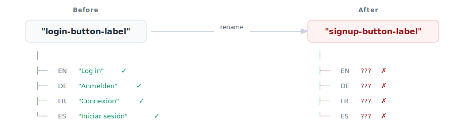
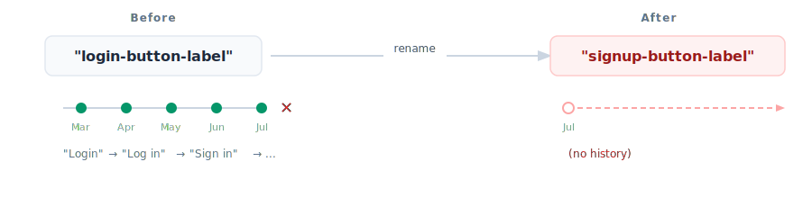
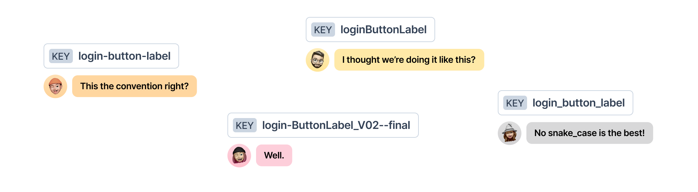

# Message Keys

A Paraglide message key does two jobs: it identifies a message across locales, and it becomes the name of the generated message function. Choosing the identity of a key and choosing its structure are separate decisions.

## Recommended: random human-readable keys

For new messages, prefer an auto-generated, human-readable key that has no semantic meaning:

```diff
- "login_button_label": "Log in"
+ "penguin_purple_shoe": "Log in"
```

[Sherlock](https://inlang.com/m/r7kp499g/app-inlang-ideExtension) generates human-readable random keys when it extracts a message. Paraglide compiles either style, so you can keep existing keys when adopting Paraglide. Stability matters more than changing an established catalog to match this recommendation.

### Why semantic keys are unstable

Semantic keys such as `login_button_label` or `user.profile.title` encode where a message belongs or what it currently says. That meaning invites renaming:

```diff
-login_button_label
+continue_button_label
```

- A login button becomes a continue button
- A component moves to another screen
- A designer changes the copy

Paraglide's type safety catches stale function calls, but every reference and locale still has to move together. Translation tools can also see a renamed key as one deleted message and one new message, breaking the linkage between translations.



Translation history, comments, screenshots, QA notes, and reviewer context are commonly attached to the message key. Renaming the key can leave that context behind.



> [!NOTE]
> Use random human-readable keys for new messages. Do not rename existing keys merely to make them random; preserving a stable identity is the goal.

### Semantic key naming adds overhead

Semantic keys also create ongoing process costs:

- Teams debate `snake_case`, `kebab-case`, or `camelCase`
- People disagree about taxonomy, such as `login` versus `auth`
- Developers have to name messages instead of shipping the feature
- Designers, translators, and automated extraction need to understand the naming convention

The product rarely benefits from the shape of the key, but the team repeatedly pays for it.



### Why random human-readable keys

A generated key such as `penguin_purple_shoe` is:

- **Stable**: It does not change when the copy or UI placement changes
- **Meaningless**: There is no naming convention or taxonomy to enforce
- **Human-readable**: People can copy, say, and search for it

Treat the key like a database ID, not like documentation. The message content, its usage, and tooling provide the context.

| Semantic keys                            | Random human-readable keys  |
| ---------------------------------------- | --------------------------- |
| Invite renaming                          | Stay stable                 |
| Can lose history on rename               | Preserve message history    |
| Require naming conventions               | Need no naming convention   |
| Usually require a developer to name them | Can be generated for anyone |

### The tradeoff: finding a message by its copy

You cannot infer the message content from `penguin_purple_shoe`. Without tooling, code review has more friction and finding a call site from visible copy takes two searches:

1. Search the source-locale message file for the visible text and copy its key.
2. Search the codebase for that stable key.

Sherlock removes much of this friction by showing message content inline and on hover:

```ts
// Sherlock shows: "Log in to your account"
m.penguin_purple_shoe();
```

This is a deliberate tradeoff: stable message identity is handled by the key, while discoverability is handled by search and tooling. Read [Use Random Human-Readable Message Keys](https://inlang.com/blog/human-readable-message-ids) for the full rationale.

### Do not share a message across unrelated contexts

Random keys are not an invitation to reuse one message everywhere. Two buttons might both say `OK` today but evolve independently tomorrow. If they share a key, changing one button to `Delete` or `Got it` also changes the other.

Give independently evolving messages their own IDs, even when their current source text is identical:

```json
{
	"calm_green_otter": "OK",
	"bright_coral_fox": "OK"
}
```

See the [message reuse rationale](https://github.com/opral/inlang/issues/4032) for a concrete example.

## Flat vs nested key structure

Random versus semantic describes a key's identity. Flat versus nested describes its shape. Paraglide supports nested keys, but flat keys provide the best generated-code and tooling experience.

### Nested keys are supported but not recommended

Paraglide JS supports nested keys through bracket notation syntax `m["something.nested"]()`, which simulates nesting without actually creating nested JavaScript objects. This approach leverages TypeScript's template literal types to provide type safety while maintaining the flat structure that enables tree-shaking.

> [!WARNING]
> While nested keys are supported, we still recommend using flat keys. Flat keys align better with how databases, applications, and compilers naturally work, even though bracket notation keeps generated modules tree-shakeable.

### Why we recommend flat keys

#### 1. Flat lists are the native format

- **Databases operate on flat structures**: Messages are stored in SQLite internally, which naturally uses flat key-value pairs
- **Applications use flat lookups**: At runtime, messages are accessed by key, not by traversing nested objects
- **Compilers work with flat lists**: The compilation process transforms each message into an individual function

#### 2. Nested keys create unnecessary complexity

While nested keys might seem convenient initially, they create complexity for the rest of the ecosystem:

- **Translators**: Have to understand hierarchical structures instead of simple key-value pairs
- **Build tools**: Need to parse and transform nested structures into flat lists
- **Developer experience**: Flat keys compile to direct function names, which provide richer IDE support such as go-to-definition and auto-imports
- **Consistency across tooling**: Flat keys mirror how translators, design tools, and message catalogs typically represent content

### How to use nested keys

If you have existing messages with dot notation, access them with bracket notation:

```json
// messages/en.json
{
	"nav.home": "Home",
	"nav.about": "About",
	"nav.contact": "Contact"
}
```

```ts
import { m } from "./paraglide/messages.js";

console.log(m["nav.home"]()); // "Home"
console.log(m["nav.about"]()); // "About"

type NavKey = "nav.home" | "nav.about" | "nav.contact";
const key: NavKey = "nav.home";
console.log(m[key]());
```

> [!NOTE]
> Bracket notation uses TypeScript's template literal types to maintain type safety. At runtime, these are still individual functions.

### Recommended flat structure

New random human-readable keys are naturally flat:

```json
// messages/en.json
{
	"calm_green_otter": "Home",
	"bright_coral_fox": "About",
	"swift_amber_deer": "Contact",
	"quiet_violet_whale": "Privacy Policy",
	"gentle_silver_owl": "Terms of Service"
}
```

```ts
import { m } from "./paraglide/messages.js";

console.log(m.calm_green_otter()); // "Home"
```

Flat keys provide:

- Direct function calls with perfect tree-shaking
- Go-to-definition and auto-import support
- No runtime lookup overhead

## Working with dynamic keys

For dynamic menu systems, create an explicit mapping from domain values to generated message functions:

```ts
import { m } from "./paraglide/messages.js";

const navMessages = {
	home: m.calm_green_otter,
	about: m.bright_coral_fox,
	contact: m.swift_amber_deer,
} as const;

const menuItems = [
	{ key: "home", href: "/" },
	{ key: "about", href: "/about" },
] as const;

menuItems.forEach((item) => {
	const label = navMessages[item.key]();
	console.log(`<a href="${item.href}">${label}</a>`);
});
```

## Migrating existing keys

Do not rename established keys solely to adopt random IDs or a different naming style. If you are migrating a nested catalog, preserve its existing identifiers where possible.

### Option 1: Keep dots in keys

Flatten nested JSON while retaining the path as the key:

```diff
// messages/en.json
{
-  "nav": {
-    "home": "Home",
-    "about": "About"
-  }
+  "nav.home": "Home",
+  "nav.about": "About"
}
```

```ts
const label = m["nav.home"]();
```

### Option 2: Adopt new flat IDs during a controlled migration

If you intentionally change IDs, migrate every locale, call site, and connected translation tool together. Prefer generated random IDs for the new identity:

```diff
// messages/en.json
{
-  "nav": {
-    "home": "Home",
-    "about": "About"
-  }
+  "calm_green_otter": "Home",
+  "bright_coral_fox": "About"
}
```

```ts
const label = m.calm_green_otter();
```
